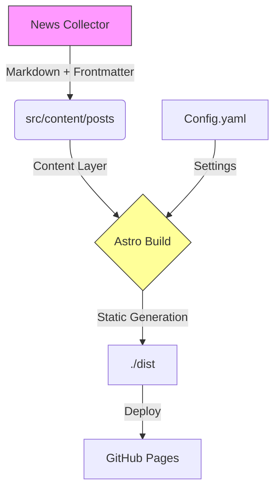

# 🧪 Noticiencias - Plataforma de Periodismo Científico

[](https://github.com/cortega26/noticiencias/actions/workflows/content-guard.yml) [](https://github.com/cortega26/noticiencias/actions/workflows/deploy.yml)
  

Noticiencias es una plataforma de noticias científicas diseñada para el público latinoamericano, priorizando la evidencia sobre el sensacionalismo. Este repositorio contiene el frontend moderno construido con **Astro 5**, migrado desde un sitio legacy en Jekyll.

## 🚀 Stack Tecnológico

- **Framework**: [Astro 5.0](https://astro.build) (Content Collections, Server Islands).
- **Estilos**: [Tailwind CSS](https://tailwindcss.com) + [Tailwind Typography](https://tailwindcss.com/docs/typography-plugin).
- **Búsqueda**: Lunr.js (lado del cliente).
- **Despliegue**: GitHub Pages (Static Site Generation).
- **Integraciones**: `noticiencias_news_collector` (fuente de datos).

## ✨ Características Clave

1.  **Rendimiento Extremo**: HTML estático por defecto, 0kb JS para la mayoría de las páginas.
2.  **View Transitions**: Navegación fluida estilo SPA sin la complejidad.
3.  **Diseño "Newsroom"**: Tipografía optimizada para lectura (Inter + Lora), modo oscuro nativo, y componentes de confianza (Trust Signals).
4.  **Content Collections**: Gestión de tipos segura (TypeScript) para `posts`, `pages`, y `authors`.

## 🏗️ Arquitectura de Contenido



## 📂 Estructura del Proyecto

```text
/
├── public/             # Assets estáticos (imágenes, favicon, CNAME)
├── src/
│   ├── components/     # Componentes UI (React/Astro)
│   │   ├── common/     # Botones, MetaTags, Analytics
│   │   ├── widgets/    # Hero, Features, Header, Footer
│   │   └── blog/       # Listas de posts, Grid items
│   ├── content/        # Colecciones de contenido (Markdown/MDX)
│   │   ├── post/       # Artículos del blog
│   │   └── config.ts   # Esquemas de validación Zod
│   ├── layouts/        # Plantillas de página (PageLayout, PostLayout)
│   ├── pages/          # Rutas del sitio (File-based routing)
│   └── utils/          # Helpers (formateo de fechas, permalinks)
├── task.md             # Checklist de migración y tareas
└── astro.config.mjs    # Configuración de Astro (sitemap, tailwind, etc.)
```

## 📝 Flujo de Trabajo Editorial

1.  **Contenido**: Los artículos viven en `src/content/post/`.
2.  **Frontmatter**: Usamos campos estrictos para garantizar calidad.
    ```yaml
    title: "Título Impactante pero Honesto"
    publishDate: 2025-01-15
    image: "~/assets/images/cover.jpg"
    category: "Tecnología"
    tags: ["IA", "Futuro"]
    author: "noticiencias-ai"
    trust_score: 0.95 # Nivel de evidencia
    ```
3.  **Imágenes**: Astro optimiza automáticamente las imágenes locales importadas.

---

_Mantenido por el equipo de Noticiencias._
